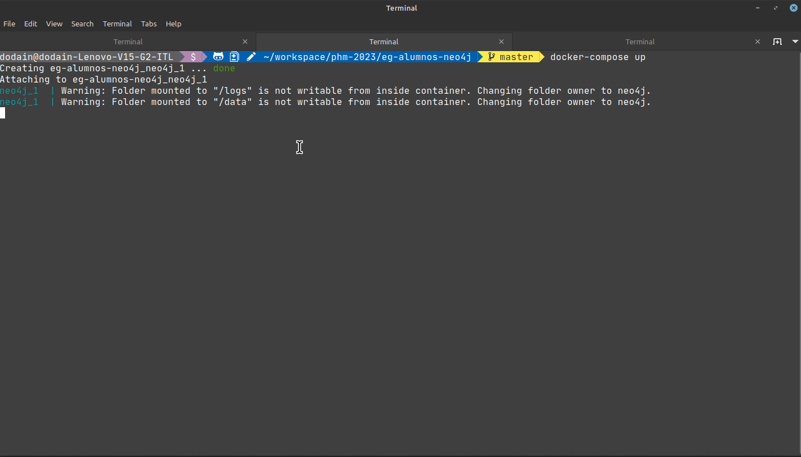

# Estudiantes de una facultad - Ejemplo puro en Neo4J

[](https://github.com/uqbar-project/eg-alumnos-neo4j/actions/workflows/build.yml)

## Prerrequisitos

Solo hace falta tener instalado algún Desktop de Docker, seguí las instrucciones de [esta página](https://phm.uqbar-project.org/material/software) en el párrafo `Docker`.

## Instalación

Para poder ejecutar el ejemplo abrí una consola de comandos y escribí

```bash
docker compose up
```

Eso va a levantar

- el servidor Neo4j en el puerto 7687
- y el cliente Neo4j en el puerto 7474

## Ingreso al cliente Neo4j

Ingresando en un navegador a `http://localhost:7474/` te podés conectar a la base utilizando el usuario `neo4j` y la contraseña `passw0rd` (ojo que es un cero y no una o)

Tenés dos scripts: 

- [el primero te permite crear un juego de datos](./scripts/01_create_fixture.cypher) y 
- [el segundo te permite hacer consultas sobre la base de grafos](./scripts/02_queries_de_alumnes.cypher)

Te mostramos cómo se generan los grafos para luego hacer una consulta:



## Objetivo

Modelar las notas y los grupos de TP de alumnes que cursan una materia de la facultad.

## Modelo

Define una base de grafos de alumnes y cursos + dos tipos de relaciones: 

* AMIGUE entre nodos alumnes y 
* CURSA entre alumne y curso, que indica en qué grupo está y qué notas tuvo.
